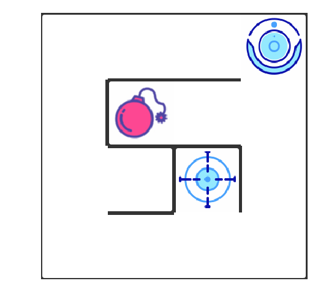

Q-Learningの強化学習アルゴリズムを用いた自動迷路歩行ロボットの実装．

上の図のように、右上にスマートロボットが表示されます．この迷路では、トラップ（赤い爆弾）と終点（青い目標点）の2つのシナリオがあります．ロボットはトラップを回避して、できるだけ早く目的地に到着するようにします．

ロボットは、上に行くu、右に行くr、下に行くd、左に行くlという動作をすることができます．
様々なアクションを行った後、状況に応じて異なる報酬が与えられます．

具体的には以下の通りです．
壁にぶつかる：-10
最後まで歩く：50
トラップへの遭遇：-30
その他：-0.1

上記の目標を達成するために、robot.pyのコードを修正して、Q-Learningを実装する．

参考文献： マップの生成コードhttps://en.wikipedia.org/wiki/Maze_generation_algorithm

